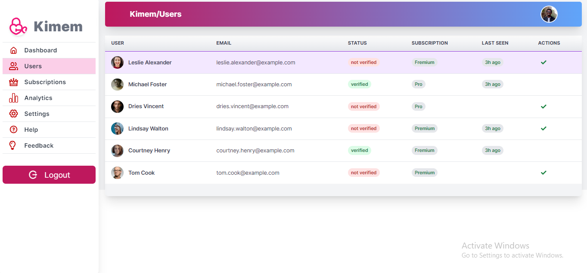

# Kimem Dashboard

A multi-purpose admin dashboard

## Main tech-stacks
<div>
<a href="https://www.typescriptlang.org/" target="_blank" style="text-decoration:none; padding-right: 4px; background-color: #f0ffff77; border-radius: 4px;">
    
</a>&nbsp;
<a href="https://react.dev/" target="_blank" style="text-decoration:none; padding-right: 4px; background-color: #f0ffff77; border-radius: 4px;">
      
 </a>&nbsp;
 <a href="https://www.android.com/" target="_blank" style="text-decoration:none; padding-right: 4px; background-color: #f0ffff77; border-radius: 4px;">
    
</a>&nbsp;
</div>

##




## Getting started
- Clone the repo
```git
git clone https://github.com/fikireab-m/Kimem-Dashboard.git
```
- Install the dependencies
```npm
npm i
```
- Run the app 
```npm
npm run dev
```
- Build your app
```npm
npm run build
```